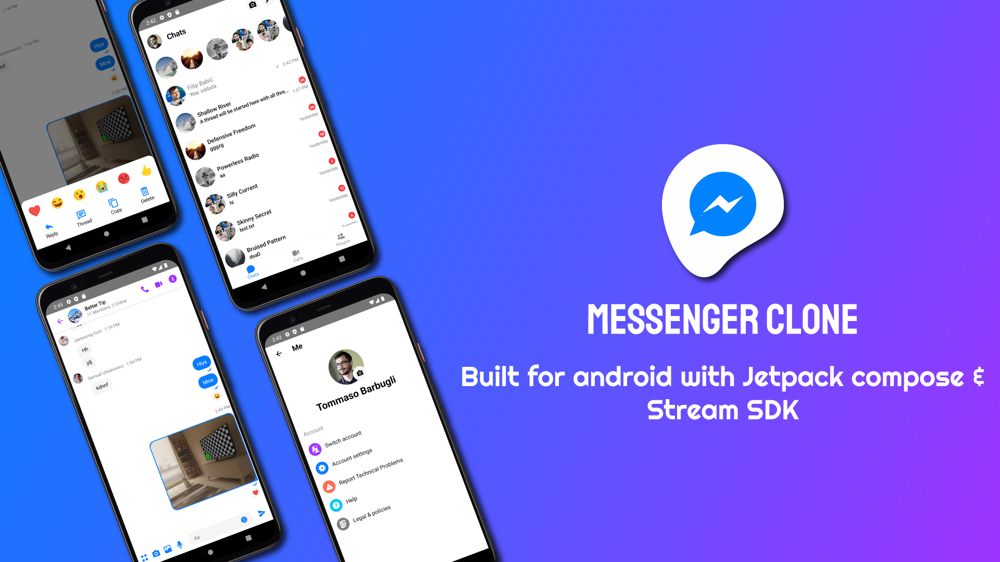
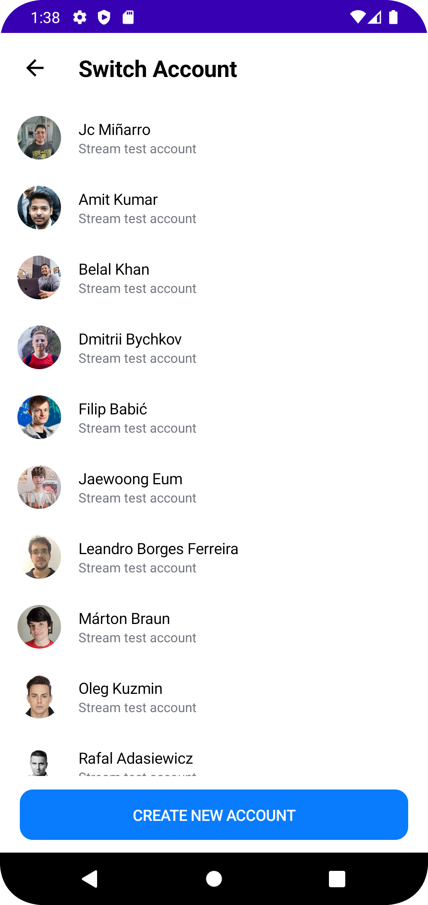
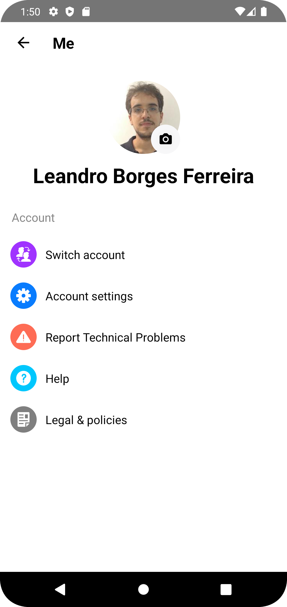
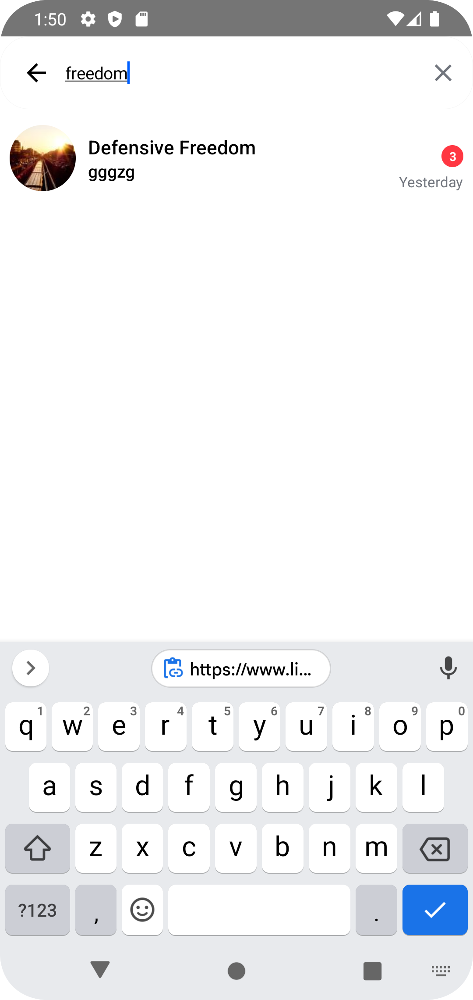
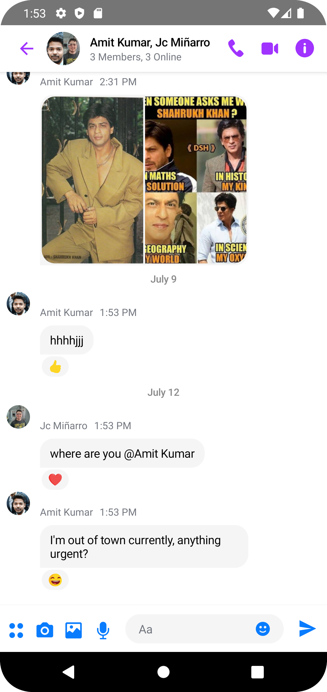
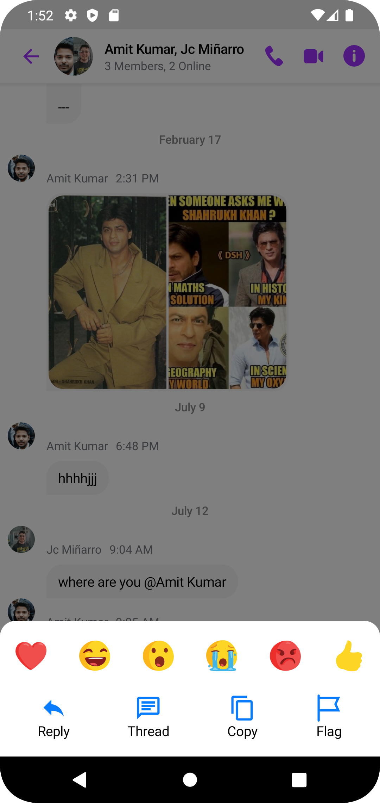
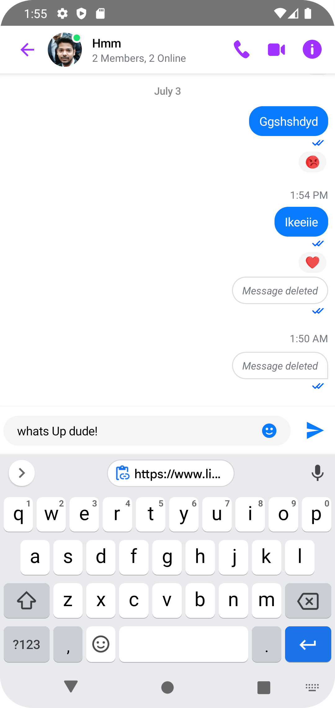
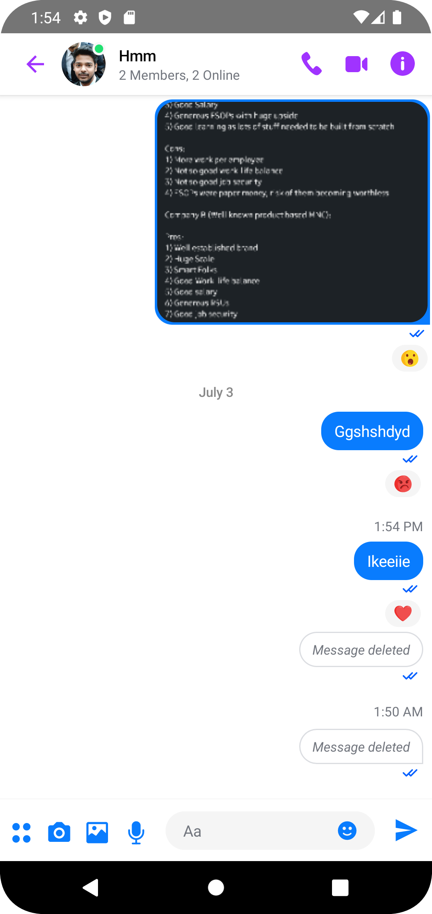
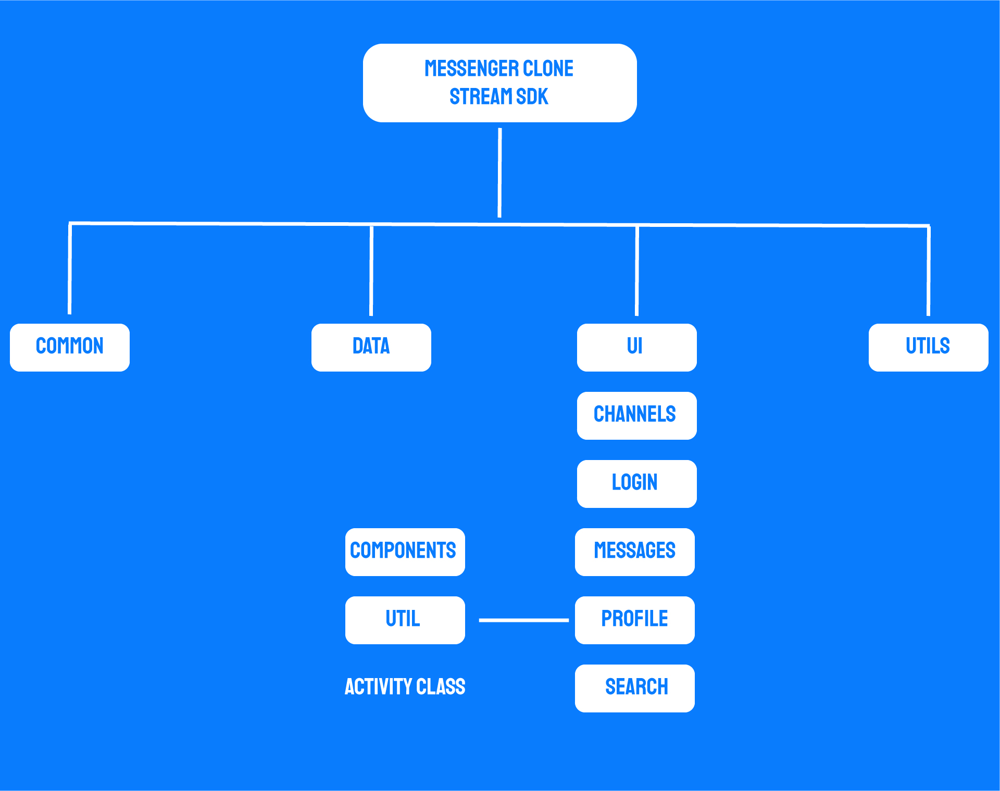
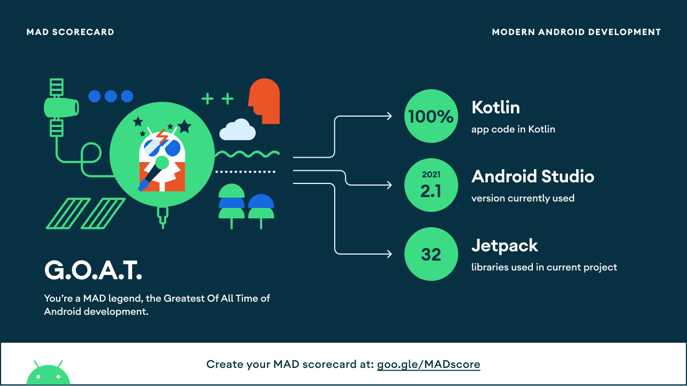

# **Messenger Clone** 

### Built for Android using [Stream SDK](https://getstream.io/chat/sdk/compose?utm_source=Github&utm_medium=Github_Repo_Content_Ad&utm_content=Developer&utm_campaign=Github_May2022_SlackAndroidClone&utm_term=DevRelOss) & [Jetpack Compose](https://www.google.com/url?sa=t&rct=j&q=&esrc=s&source=web&cd=&cad=rja&uact=8&ved=2ahUKEwjspaT-4Zv5AhWziP0HHXYtBIEQFnoECAsQAQ&url=https%3A%2F%2Fdeveloper.android.com%2Fjetpack%2Fcompose&usg=AOvVaw2BpAQ4DMwUiKSOtVRyUczM)

This project is developed by [MathRoda](https://www.linkedin.com/in/mathroda/) for more projects [GitHub](https://github.com/MathRoda/) .

# Showcase Video
watch video here [Messenger Clone Showcase](https://youtu.be/T34epxQhFJc)


# Blog ✍

I wrote a article contains more details about the project , read it here : https://medium.com/@mathroda/messenger-clone-using-jetpack-compose-stream-sdk-2defd636eaf0

## Application Install

***You can Install and test latest Messenger Clone app from below 👇***

[](https://github.com/MathRoda/Messenger-clone/releases/download/1.0.0/MesengerClone.apk)

<a href="https://getstream.io/chat/sdk/compose?utm_source=Github&utm_medium=Github_Repo_Content_Ad&utm_content=Developer&utm_campaign=Github_May2022_SlackAndroidClone&utm_term=DevRelOss">

</a>

## 🛥 Stream Chat SDK
Messenger Android clone was built with __[Stream Chat SDK for Compose](https://getstream.io/chat/sdk/compose?utm_source=Github&utm_medium=Github_Repo_Content_Ad&utm_content=Developer&utm_campaign=Github_May2022_SlackAndroidClone&utm_term=DevRelOss)__ to implement messaging systems.

## About
 
- Clean and Simple UI with Jetpack Compose.
- Best and Clean Code Quality following Modern Android Development
- Stream SDK for messaging systems

## 📸 Screenshots 

|   |   |   |   |
|---|---|---|---|
| |  |  |  
| |  |  | 

## 🛠 Tech Sacks & Open Source Libraries
- 100% [Jetpack Compose](https://developer.android.com/jetpack/compose) based + [Coroutines](https://github.com/Kotlin/kotlinx.coroutines) + [Flow](https://kotlin.github.io/kotlinx.coroutines/kotlinx-coroutines-core/kotlinx.coroutines.flow/) for asynchronous tasks.
- [Compose Chat SDK from Stream](https://getstream.io/chat/sdk/compose?utm_source=Github&utm_medium=Github_Repo_Content_Ad&utm_content=Developer&utm_campaign=Github_May2022_SlackAndroidClone&utm_term=DevRelOss): The Jetpack Compose Chat Messaging SDK is built on a low-level chat client and provides modular, customizable Compose UI components that you can easily drop into your app.
- Jetpack
  - Compose: Android’s modern toolkit for building native UI.
  - Lifecycle: Observe lifecycle changes.
  - ViewModel: UI related data holder and lifecycle aware.
  - Room Persistence: Constructs Database by providing an abstraction layer over SQLite to allow fluent database access.
  - Paging3: Loads and displays pages of data from a larger dataset from local storage or over network.
- [Retrofit2 & OkHttp3](https://github.com/square/retrofit): Construct the REST APIs and paging network data.
- [Timber](https://github.com/JakeWharton/timber): A logger with a small, extensible API which provides utility.


## 🏛️ Package Structure




## 💯 MAD Score



## Copyrights & Credits

All copyrights of the resources, logo, branding, content, concepts, and phrases that are used in this open-source project belong to [Meta(Facebbok)](https://facebook.com/).

---

## If you like my projects you can buy me a cup of coffee 💙
  
<a href="https://www.buymeacoffee.com/mathroda"></a>


 ## Contact
you can connect with me here [LinkedIn](https://www.linkedin.com/in/mathroda/) .

# License
```xml
Copyright 2022 MathRoda, Inc. All Rights Reserved.

Licensed under the Apache License, Version 2.0 (the "License");
you may not use this file except in compliance with the License.
You may obtain a copy of the License at

   http://www.apache.org/licenses/LICENSE-2.0

Unless required by applicable law or agreed to in writing, software
distributed under the License is distributed on an "AS IS" BASIS,
WITHOUT WARRANTIES OR CONDITIONS OF ANY KIND, either express or implied.
See the License for the specific language governing permissions and
limitations under the License.
```
 
